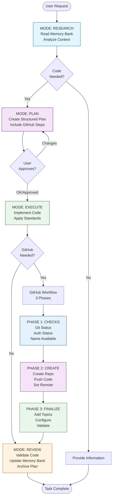

# 🚀 Cursor Rules MDC - Professional AI Development System

<div align="center">

[](https://github.com/ShakaTry/cursor-rules-mdc)
[](LICENSE)
[](https://cursor.sh)
[](https://claude.ai)

**Transform Claude in Cursor into a senior developer with automatic professional methodology**

[Installation](#-installation) • [How it Works](#-how-it-works) • [Workflow](#-workflow-visualization) • [Commands](#-available-commands) • [FAQ](#-faq)

</div>

---

## 📑 Table of Contents

- [Overview](#-overview)
- [Key Features](#-key-features)
- [Workflow Visualization](#-workflow-visualization)
- [Installation](#-installation)
- [The 8 MDC Rules](#-the-8-mdc-rules)
- [Automatic Workflow](#-automatic-workflow)
- [GitHub Integration](#-github-integration)
- [Memory Bank System](#-memory-bank-system)
- [Available Commands](#-available-commands)
- [Practical Examples](#-practical-examples)
- [FAQ](#-faq)
- [Contributing](#-contributing)

---

## 🎯 Overview

The **Cursor Rules MDC System** is a professional development framework that transforms Claude into a methodical senior developer. It enforces automatic workflows, professional standards, and comprehensive GitHub integration - all without manual intervention.

### 🌟 What Makes It Special?

- **Zero Configuration**: Just install and start coding
- **Automatic Methodology**: Claude follows professional workflows without prompting
- **GitHub Integration**: Complete repository management from verification to deployment
- **Memory Bank**: Persistent context across sessions
- **Professional Standards**: ESLint, testing, security - all automatic

---

## ✨ Key Features

| Feature | Description |
|---------|------------|
| **🔄 Automatic Modes** | RESEARCH → PLAN → EXECUTE → REVIEW workflow |
| **📋 Mandatory Planning** | Never codes without a validated plan |
| **🧪 Test Coverage** | Automatic >80% test coverage enforcement |
| **🔒 Security First** | OWASP standards and sensitive file scanning |
| **🐙 GitHub Workflow** | 3-phase repository management (Check → Create → Finalize) |
| **🧠 Memory Bank** | Persistent context and project history |
| **📊 Minimal Impact** | <1% context usage (~1,500 tokens) |
| **🚀 Productivity** | 3-4 minutes for complete modules vs 40-65 traditional |

---

## 🗺️ Workflow Visualization



---

## 📦 Installation

### Prerequisites
- [Cursor IDE](https://cursor.sh) installed
- Git configured
- GitHub CLI (optional, for GitHub features)

### Quick Install

1. **Clone the repository**
```bash
git clone https://github.com/ShakaTry/cursor-rules-mdc.git
cd cursor-rules-mdc
```

2. **For new projects**
```bash
# Use as template
mkdir my-awesome-project
cd my-awesome-project
cp -r ../cursor-rules-mdc/.cursor .
```

3. **For existing projects**
```bash
# Copy only the rules
cp -r /path/to/cursor-rules-mdc/.cursor /path/to/your-project/
```

### Alternative: Manual Installation in Cursor

1. Open Cursor IDE
2. Go to **Settings → Rules → Project Rules**
3. For each file in `.cursor/rules/`:
   - Click "New Rule"
   - Copy the filename (e.g., `001_workspace`)
   - Paste the entire MDC file content
   - Save

---

## 📂 Project Structure

```
cursor-rules-mdc/
├── .cursor/
│   ├── rules/                    # 8 MDC rule files
│   │   ├── 001_workspace.mdc     # Core rules (alwaysApply)
│   │   ├── 002_planning_methodology.mdc
│   │   ├── 003_coding_standards.mdc
│   │   ├── 004_security_guidelines.mdc
│   │   ├── 005_testing_strategy.mdc
│   │   ├── 006_memory_bank.mdc   # Memory system (alwaysApply)
│   │   ├── 007_modes.mdc         # Automatic modes (alwaysApply)
│   │   └── 008_github_workflow.mdc # GitHub integration (alwaysApply)
│   └── plans/                    # Auto-generated action plans
│       └── completed-tasks/      # Archived plans
├── memory-bank/                  # Persistent context
│   ├── activeContext.md         # Current session context
│   ├── quickStart.md            # Quick reference
│   └── sessionHistory.md        # Project history
└── README.md                    # This file
```

---

## 📜 The 8 MDC Rules

### 1️⃣ **001_workspace.mdc** - Core Foundation
- Defines the fundamental workflow
- Enforces Memory Bank reading at startup
- Sets up automatic mode transitions
- **Always Applied** ✅

### 2️⃣ **002_planning_methodology.mdc** - Mandatory Planning
- Automatic `/plan` creation before any code
- Structured plan format
- Validation requirement ("OK" or "Approved")

### 3️⃣ **003_coding_standards.mdc** - Professional Standards
- ESLint and Prettier configuration
- JSDoc documentation
- Clean code principles
- Language-specific best practices

### 4️⃣ **004_security_guidelines.mdc** - Security First
- OWASP standards implementation
- Input validation
- Authentication patterns
- Sensitive data handling

### 5️⃣ **005_testing_strategy.mdc** - Test Coverage
- Automatic >80% coverage enforcement
- Jest/Vitest integration
- Unit and integration tests
- TDD approach when applicable

### 6️⃣ **006_memory_bank.mdc** - Persistent Context
- Session history tracking
- Active context management
- Knowledge preservation
- **Always Applied** ✅

### 7️⃣ **007_modes.mdc** - Automatic Workflow
- MODE transitions (RESEARCH → PLAN → EXECUTE → REVIEW)
- Automatic mode switching
- Context-aware behavior
- **Always Applied** ✅

### 8️⃣ **008_github_workflow.mdc** - GitHub Integration
- 3-phase repository management
- Automatic verification and creation
- Topic and configuration management
- **Always Applied** ✅

---

## 🔄 Automatic Workflow

### The 4 Modes

#### 🔍 **MODE: RESEARCH** (Default)
- Reads Memory Bank on startup
- Analyzes existing code and context
- Gathers requirements
- **Auto-transitions** to PLAN when code is needed

#### 📋 **MODE: PLAN**
- Creates structured action plans
- Includes GitHub steps if repository creation needed
- Waits for explicit validation
- **Auto-transitions** to EXECUTE after approval

#### ⚡ **MODE: EXECUTE**
- Implements code following the plan
- Applies all coding standards
- Runs GitHub workflow if needed
- **Auto-transitions** to REVIEW when complete

#### ✅ **MODE: REVIEW**
- Validates implementation
- Updates Memory Bank
- Archives completed plans
- Documents learnings

---

## 🐙 GitHub Integration

### 3-Phase Workflow

#### **PHASE 1: CHECKS** 🔍
```bash
git status --porcelain          # Clean working tree?
git branch --show-current       # On main/master?
gh auth status                  # Authenticated?
gh repo view [name] 2>/dev/null # Name available?
```

#### **PHASE 2: CREATE** 🚀
```bash
gh repo create [name] \
  --public \
  --description "[description]" \
  --push \
  --source=.
```

#### **PHASE 3: FINALIZE** ✨
```bash
gh repo edit [name] \
  --add-topic "cursor" \
  --add-topic "mdc" \
  --add-topic "[tech-stack]"
```

### Security Features
- Automatic sensitive file scanning (.env, .key, secrets)
- Repository name validation
- Rollback on errors
- Clean working tree enforcement

---

## 🧠 Memory Bank System

The Memory Bank provides persistent context across sessions:

### **activeContext.md**
- Current session state
- Active objectives
- Recent decisions
- Next steps

### **sessionHistory.md**
- Completed tasks
- GitHub repositories created
- Important decisions
- Lessons learned

### **Auto-Updates**
- After each mode transition
- On task completion
- When creating repositories
- On significant decisions

---

## 🛠️ Available Commands

### Planning Commands
| Command | Description |
|---------|------------|
| `/plan` | Automatic - Claude creates plans without prompting |

### GitHub Commands
| Command | Description |
|---------|------------|
| `/gh-check` | Run all pre-creation verifications |
| `/gh-create [name]` | Complete 3-phase workflow |
| `/gh-quick [name]` | Quick creation without finalization |
| `/gh-config [name]` | Post-creation configuration |
| `/gh-topics [name] [topics]` | Add custom topics |

### Validation Keywords
- `OK` - Approve plan/action
- `Approved` - Approve plan/action
- Any modification suggests changes

---

## 💡 Practical Examples

### Example 1: Creating a New API
```
You: "I need a REST API for user management"

Claude: [MODE: RESEARCH] *reads Memory Bank*
        [MODE: PLAN] *creates detailed plan*
        
/plan User Management API
1. Create Express server
2. User CRUD endpoints  
3. JWT authentication
4. 90% test coverage
5. GitHub repository creation

You: "OK"

Claude: [MODE: EXECUTE] *implements entire API*
        [GitHub Workflow] *creates and configures repo*
        [MODE: REVIEW] *validates and documents*
```

### Example 2: Quick Module Creation
```
You: "Create a date formatting utility"

Claude: [Automatic workflow]
        → Research context
        → Plan with tests
        → Wait for approval
        → Implement with >80% coverage
        → Update Memory Bank
        
Time: ~3-4 minutes (vs 40-65 traditional)
```

---

## ❓ FAQ

### **Q: Do I need to tell Claude to plan?**
**A:** No! Planning is automatic. Claude will create a `/plan` whenever code is needed.

### **Q: What if I don't have GitHub CLI?**
**A:** The system works perfectly without it. GitHub features are optional enhancements.

### **Q: Can I modify the rules?**
**A:** Yes! Edit the MDC files to customize behavior. The system is fully extensible.

### **Q: How much context does it use?**
**A:** Less than 1% (~1,500 tokens), leaving 99%+ for your actual code.

### **Q: Will Claude remember my project between sessions?**
**A:** Yes! The Memory Bank persists all important context and decisions.

---

## 🤝 Contributing

We welcome contributions! Please:

1. Fork the repository
2. Create a feature branch
3. Follow the MDC standards
4. Submit a pull request

---

## 📄 License

MIT License - see [LICENSE](LICENSE) file

---

## 🙏 Acknowledgments

- Built for the [Cursor](https://cursor.sh) community
- Powered by Claude Opus 4
- Inspired by professional development best practices

---

<div align="center">

**Ready to code like a senior developer?**

[Get Started](#-installation) • [Report Issues](https://github.com/ShakaTry/cursor-rules-mdc/issues) • [Star on GitHub](https://github.com/ShakaTry/cursor-rules-mdc)

Made with ❤️ by the Cursor community

</div> 